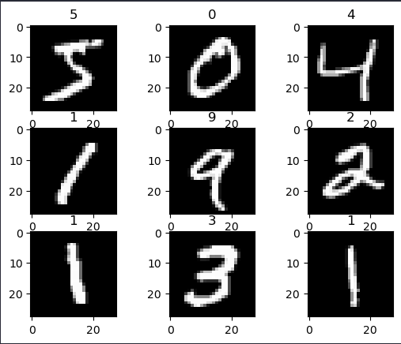
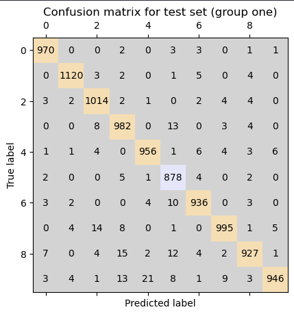

<!-- Make sure math expressions are renderder correctly when converted to pdf -->

Joakim Edvardsen, IE500618

# MNIST Dataset - Model Comparisons

## _Abstract_

_In this report we will look at the MNIST Dataset for handwritten digits, separate the data into 3 local section and create a model for each sections. Combining the models can yield a better result than creating a model for the whole dataset at once. We will look at and compare both the methods and draw conclusion for which one yielded the best result. We will also look at the developer experience with both methods._

## Introduction

In many cases it could be valuble to look at the dataset and create models in various ways to find out which one yields the best result. In this article will use the dataset from MNIST with handwritten digits to practice and compare different models, with different section splitting of the data.

## The Data

The dataset is a set from [MNIST](http://yann.lecun.com/exdb/mnist/) that contains images of handwritten number. Each image is represented by 28 \* 28 pixels where each pixel is a value between 0 and 255. 0 is equal to black and 255 is equalt to white. Each image is manually labeled with the corresponding digit.

<figure align="center">
  
  <figcaption>First nine digist of the train set</figcaption>
</figure>

The set is split in two subsets. The first one contains 60 000 rows, meaning 60 000 images and their corresponding digits. This is the set used for training the models. The second set contains 10 000 rows, meaning 10 000 images with their corresponding digits. This is the set used for testing the model after it's been train. It's important to not mix these sets. When evaluating the model we want to evaluate it on never before seen data to make sure the model has generalized and not memorized.

We want to split this data furtheremore into 3 local section. One for digits between 0-2, one for digits between 3-5 and lastly one for digits between 6-9. It's important to notice that the last section contains $\frac{4}{10}$ of the set whilst the other to section contains $\frac{3}{10}$ of the set.

## The Models

When creating the models we want to create one model for each of the sections. The first two models are pretty much the same, but the last one has to be modified slightly. Since the set contains images for digist 6,7,8 and 9 there are escentialy 4 classification, meaning we need 4 neurons in the output layers, whereas in the first two models we only need 3 neurons. Otherwise the models are the same with the input layer containing 28\*28 neurons. There are to hidden layers, the first one with 128 neurons and the second one with 64 neuron.

All the models had 98-99% accuracy during training. To make sure this is not memorized we use the test set that so far has never been shown to the model. If we get a result somewhat close to the result during training we now that the model has generelized. After validation the models we seen in fact that this is excatly what we get, where the test accuracy is slightly lower, but nothing to worry about.

For the global model I used the same structure. 1 input layer, 2 hidden layers and 1 output layer. The input layers and both of the hidden layeres are the same as in the local models, however the output layer had to be modified to take account for the 10 different classification it can spit out.

## Result

<table>
  <tr>
    <th>What model</th>
    <th>Training accuracy</th>
    <th>Testing accuracy</th>
  </tr>
  <tr>
    <td>Local model for digits 0-2</td>
    <td>99.85%</td>
    <td>99.45%</td>
  </tr>
  <tr>
    <td>Local model for digits 3-5</td>
    <td>99.37%</td>
    <td>98.72%</td>
  </td>
  <tr>
    <td>Local model for digits 6-9</td>
    <td>98.97%</td>
    <td>98.48%</td>
  </td>
  <tr>
    <td>Global model for all digits</td>
    <td>97.58%</td>
    <td>97.24%</td>
  </td>
</table>

<figure align="center">
  
  <figcaption>Confusion matrix for the global model</figcaption>
</figure>

## Comparison

From the result section above we can see that all the models did quite well with an average accuracy of 98.47% between all the 4 models. It might be more interesting to look at the average of the 3 local models compared to the global model. If we do the calculation the average coputes to 98.88%. This is more than 1% higher than the global model.

## Conclusion

All the models are quite similar, however the local models performed a tiny bit better. For this dataset there might not be any reason to separate the data and create multiple models as it requires more of the developer and doesn't really yield any valuable result. But for other types of datasets there might be a valid reason and could actually help to make the prediction problem more manageable.

## Sources

- [Jupyter Notebook with soruce code](https://github.com/jKm00/machine-learning/blob/main/assignment/assignment-2/assignmend-2.ipynb)
- [MNIST Dataset](http://yann.lecun.com/exdb/mnist/)
  x
